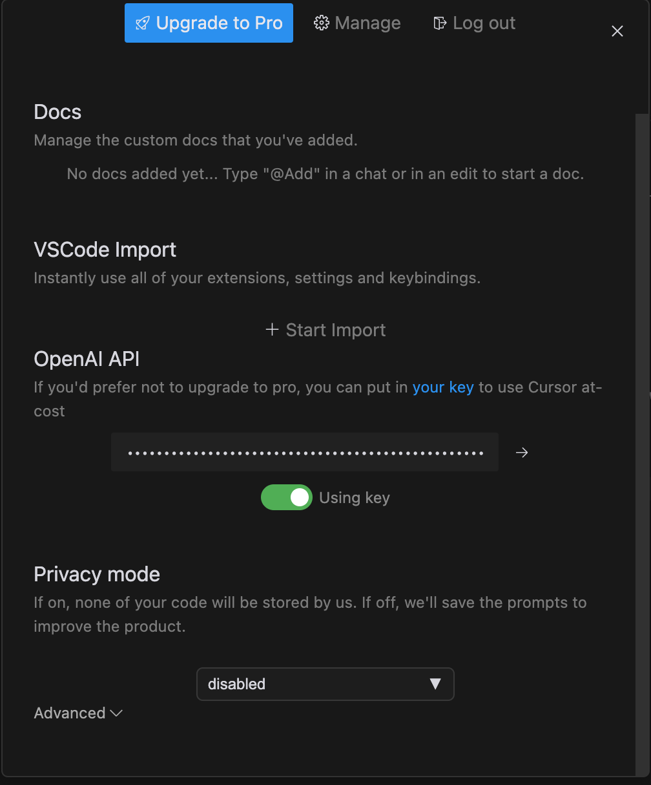
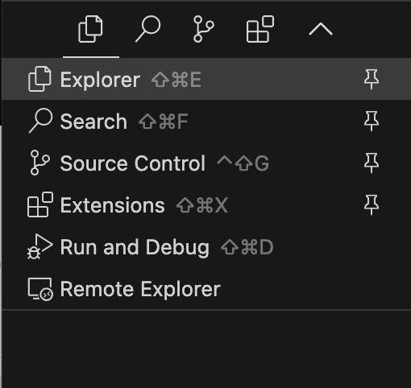

# Instrukcja przygotowania

## OpenAI i Github Copilot

1. Zakładamy konto na platformie openai i pobieramy klucz API: https://platform.openai.com/api-keys. Klucz będzie potrzebny później, więc proszę go zapisać (lub utworzyć dopiero gdy będzie potrzebny).

2. Aktywujemy Github Copilot: https://github.com/settings/copilot

## Instalacja oprogramowania

1. Instalujemy IDE cursor.sh: https://cursor.sh/

2. Po pierwszym uruchomieniu, cursor.sh poprosi o zalogowanie się. Logujemy się za pomocą konta Github.

3. Klikamy przycisk "Open cursor's AI settings" (koło zębate w prawym górnym rogu).

4. W sekcji OpenAI API dodajemy klucz do API pobrany wcześniej i klikamy suwak "using key" (jeśli nie jest już włączony).

5. Instalujemy plugin Github Copilot do cursor.sh. W menu wybieramy "Extensions":

6. Szukamy GitHub Copilot i instalujemy plugin:

7. Po instalacji będzie konieczne aktywowanie pluginu poprzez zalogowowanie się do Githuba. Plugin wyświetli odpowiedni komunikat. Jeśli tak się nie dzieje, klikamy ikonę pluginu w prawym dolnym rogu i wybieramy "Activate GitHub Copilot" (lub restartujemy cursor.sh).

